# 🌳#1 Get Started

> 서버 설치 및 실행

```bash
※ 반드시 superuser 3개 생성 후 loaddata 실행할 것!!!
$ git clone (repo주소)
---- 하위 폴더 이동
$ python -m venv venv (가상 환경 생성)
$ source venv/Scripts/activate (해당 터미널 삭제 및 다시 생성으로 대체 가능)
---- 백엔드
$ pip install -r requirements (장고 및 설치패키지)
$ python manage.py migrate (데이터베이스에 모델 반영)
$ python manage.py createsuperuser (슈퍼유저 생성. 반드시 3번 생성할 것!! 
ex) user1, user2, user3)
$ python manage.py loaddata genres.json movies_popular.json articles.json comments.json quiz1.json quiz2.json(데이터 불러오기)
$ python manage.py runserver (서버 실행)
---- 프론트엔드
$ npm install (Vue 및 설치패키지)
$ npm run serve (서버 실행)
```

# 🌳#2 개요

### 🌱#2-1 Vue

```
front-server/src
|-- App.vue
|-- api
|   `-- drf.js
|-- assets
|   |-- Kim Movie.png
|   |-- Tangled.png
|   |-- ZZangu.png
|   |-- back.jpg
|   |-- logo.png
|   |-- ssafy_logo.png
|   |-- stoplogo.png
|   `-- winter.png
|-- components
|   |-- AdvertiseMovie.vue
|   |-- AnonymousArticleList.vue
|   |-- AnonymousArticleListItem.vue
|   |-- AnonymousCommentCreate.vue
|   |-- AnonymousCommentView.vue
|   |-- AnonymousCommentViewItem.vue
|   |-- ArticleList.vue
|   |-- ArticleListItem.vue
|   |-- ArticleView.vue
|   |-- CommentCreate.vue
|   |-- CommentView.vue
|   |-- CommentViewItem.vue
|   |-- DetailArticleList.vue
|   |-- DetailArticleListItem.vue
|   |-- FooterView.vue
|   |-- GenreMovie.vue
|   |-- HeaderMovie.vue
|   |-- RecommendForYou.vue
|   |-- SearchedMovie.vue
|   |-- SearchedMovieCard.vue
|   `-- SearchedMovieCardItem.vue
|-- main.js
|-- router
|   `-- index.js
|-- store
|   |-- index.js
|   `-- modules
|       |-- accounts.js
|       `-- articles.js
`-- views
    |-- AnonymousArticleDetailView.vue
    |-- AnonymousArticlePutView.vue
    |-- AnonymousCommunityView.vue
    |-- AnonymousCreateView.vue
    |-- ArticleDetailView.vue
    |-- ArticlePutView.vue
    |-- CommunityView.vue
    |-- CreateView.vue
    |-- HomeView.vue
    |-- LogInView.vue
    |-- LogOutView.vue
    |-- MovieDetailView.vue
    |-- MyProfileView.vue
    |-- NoneView.vue
    |-- ProfileView.vue
    |-- Quiz1View.vue
    |-- Quiz2View.vue
    |-- SearchMoviesView.vue
    `-- SignUpView.vue
```

### 🌱#2-2 Template & Components


### 🌱#2-3 E-R Diagram

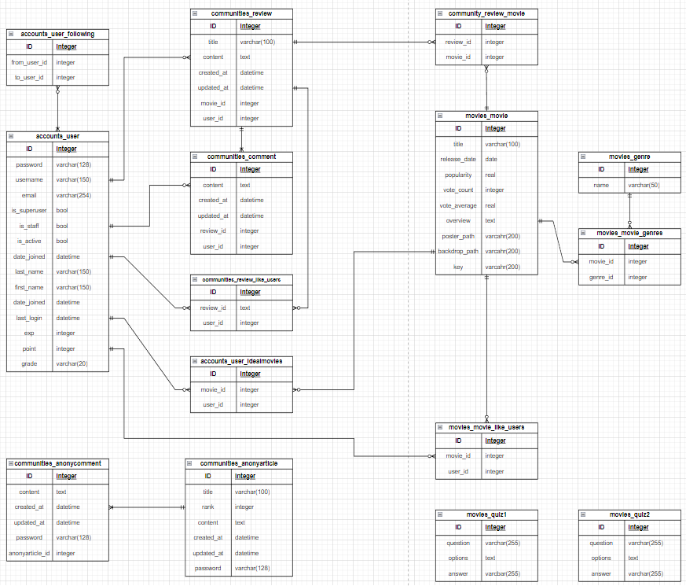

### 🌱2-4 목표

- 사용자 경험 최적화를 위한 DB relation 및 UI 구조 세부 설계 및 기능 구체화
- 유저가 직접 선택한 장르들을 기반으로 적절한 영화 추천 알고리즘 구현
- git branch를 사용한 분산개발 및 병합 후 피드백
- 백엔드와 프론트엔드 몰입을 위한 역할 배분
- 부트스트랩 및 CSS 속성을 이용한 반응형 & 범용적인 무비사이트를 참고한 어플리케이션 제작
- 백엔드의 POSTMAN과 프론트엔드의 개발자도구의 요청 및 응답 비교

### 🌱#2-5 팀원 및 업무 분담 내역

| .png)                                                                                                                                 |              |
|:-------------------------------------------------------------------------------------------------------------------------------------------------------------------------------------------- |:---------------------------------------------------------------------------------------------------:|
| **백엔드** 추천 알고리즘 설계 / 퀴즈 알고리즘 설계 / 게시글, 댓글 알고리즘 설계/ 익명 게시글 댓글 알고리즘 설계/ 팔로우 알고리즘 설계/ 검색 알고리즘 설계 / 게시글 좋아요 알고리즘 설계 / 경험치와 포인트를 통한 등급알 고리즘 설계/ 추천, 세부 장르, 평점순, 인기순, 최신순 기능 등 세부 DB 구현 및 API 설계 / | **프론트엔드** 카드 등 컴포넌트 제작 및 인증 페이지 / 세부 기능 구현 / 메인 페이지 배경 영상/ 커뮤니티 페이지 / 모달 관련 세부 기능 / 라우터 및 라우터 가드 구현 |

# 🌳#3 핵심 기능 & 디자인

### 🌱#3-0 홈

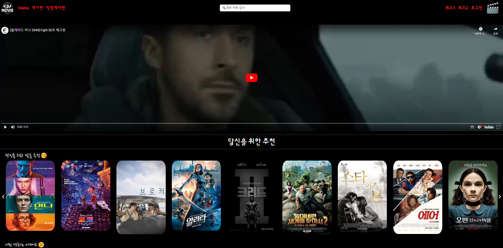

시작페이지에는 메인페이지로 자동으로 이동합니다.

- 기본적으로 홈 화면의 상단에는 추천 영화의 예고편 영상이 재생됩니다.

- 상단에는 찜 해놓은 장르가 포함된 영화가 띄워집니다.

- 현재 인기순 영화 및 장르별 영화들을 보여줍니다.

### 🌱#3-1 전체 영화(화면 축소 25%)

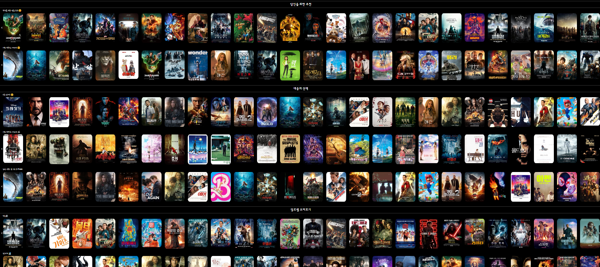

- 첫째행부터 순서대로>>

- 찜한 영화와 일치하는 장르를 가진 영화 추천합니다.

- 전체 영화을 랜덤으로 추천합니다.

- 인기 영화를 추천합니다.

- 상위 평점 영화를 추천합니다.

- 최신 영화를 추천합니다.

- 장르별 영화를 추천합니다.

### 🌱#3-2 영화 검색 기능

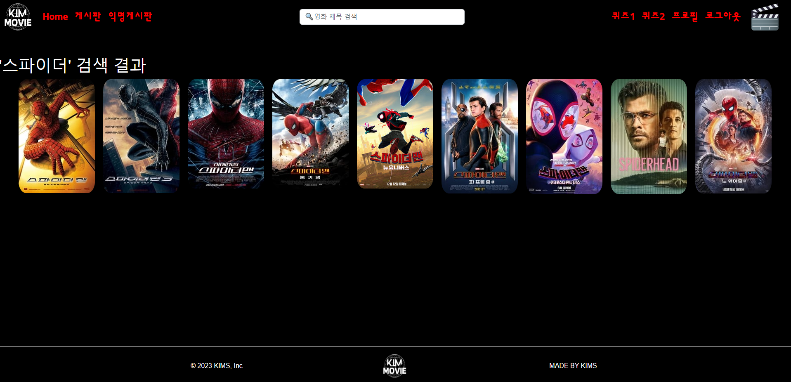

- 원하는 영화 정보를 얻기위해 검색을 통해 영화를 조회할 수 있습니다.

- 전체 영화에서 검색바와 연동되어 실시간으로 요청을 처리합니다.

### 🌱#3-3 영화 상세 정보

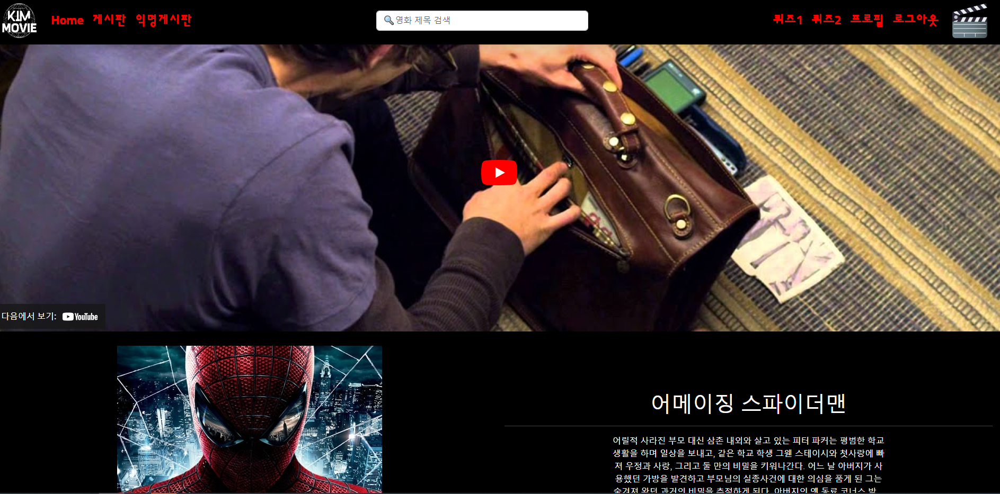

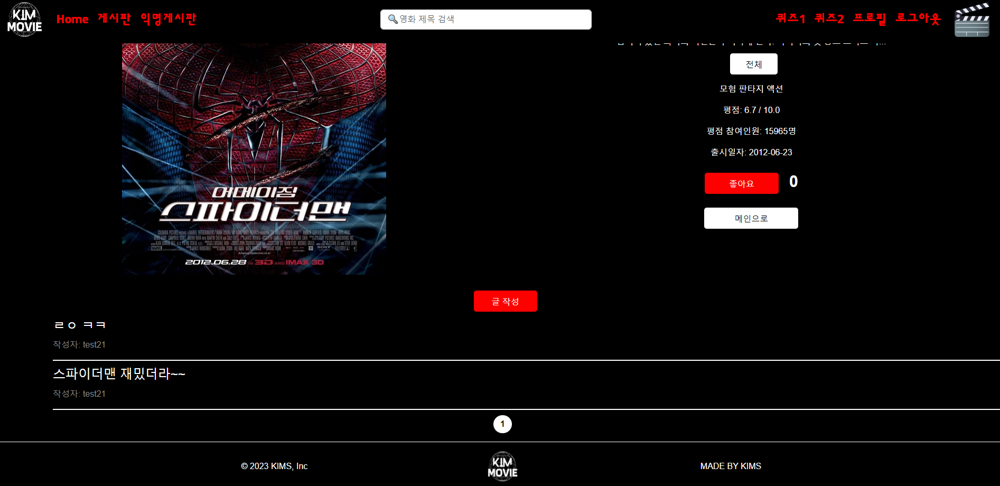

- 영화의 세부 정보 및 유튜브 영상이 포함된 다이얼로그입니다.

- 유튜브로 영화 트레일러를 시청할 수 있으며, 좋아요 버튼을 누르면 프로필에 해당 영화가 등록되고 관련 장르를 추천 받습니다.

- 해당 영화에 대한 게시글을 작성할 수 있습니다.

### 🌱#3-3 게시글 작성

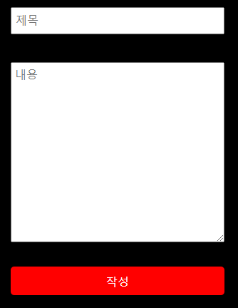

- 게시글의 제목 및 내용을 작성해 유저 및 게시글을 DB에 저장합니다.

- 작성한 게시글은 게시판에 즉각 반영되며 사용자만 수정 및 삭제가 가능합니다.

### 🌱#3-4 게시판

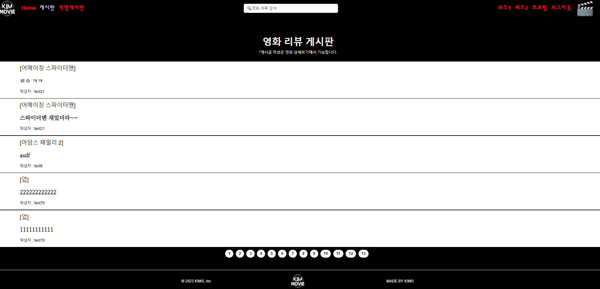

- 전체 영화의 게시글을 모아놓은 게시판입니다. 게시글 작성 및 페이지네이션을 구현했으며, 작성 날짜가 현재 기준으로 갱신됩니다.

### 🌱#3-5 게시글 상세 및 댓글 작성

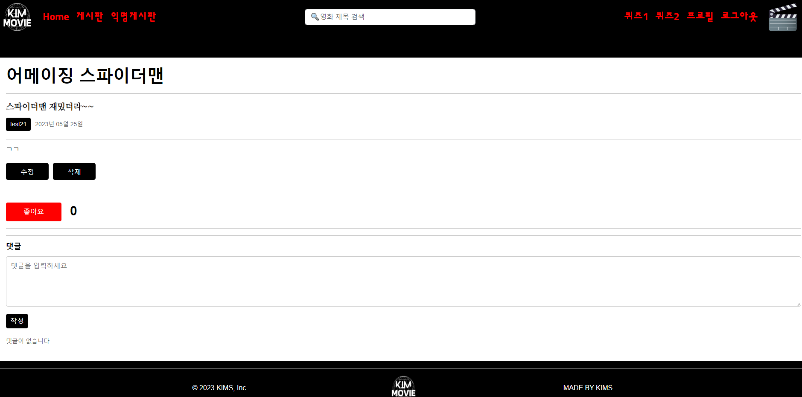

- 작성자를 클릭해 해당 유저의 프로필을 조회할 수 있습니다.

- 게시글을 삭제 및 수정할 수 있습니다.

- 개별 게시글의 좋아요를 누를 수 있습니다. 

- 댓글 작성 및 수정 및 삭제를 할 수 있도록 구현했습니다.

### 🌱#3-6 로그인

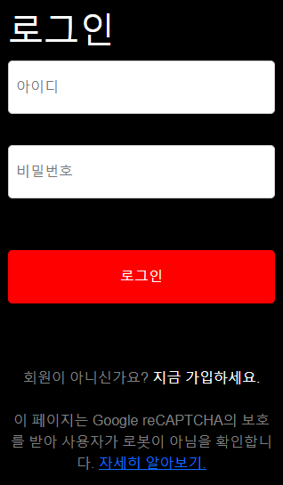

- 로그인 페이지입니다.

### 🌱#3-7 회원가입

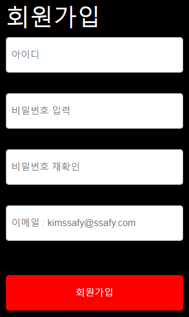

- 회원가입 페이지입니다.

### 🌱#3-8 내 프로필 및 회원정보 수정

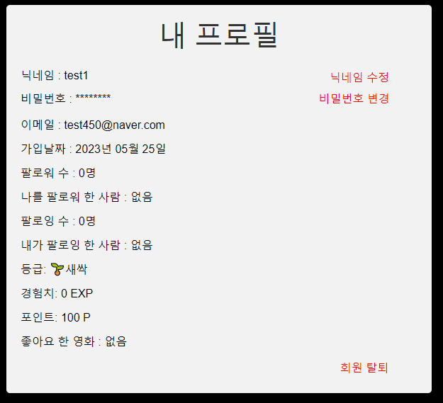

- 사용자 및 타인의 개인 프로필 페이지입니다.

- 사용자는 타인의 프로필을 팔로우 및 언팔로우할 수 있으며, 만약 스스로의 프로필일 경우 닉네임 수정, 비밀번호 수정, 회원탈퇴 기능이 활성화 됩니다.

- 게시글 및 댓글을 작성하거나 퀴즈를 풀 경우 획득할 경험치 및 포인트를 나타냅니다.

### 🌱#3-9 타인의 프로필

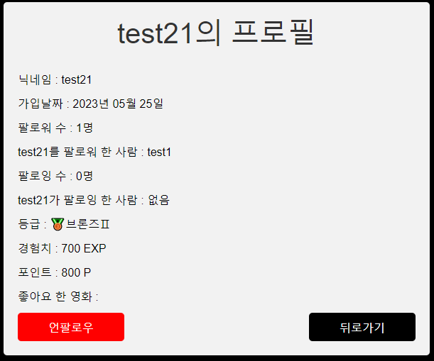

- 타인의 프로필 페이지에서 팔로우 및 언팔로우를 할 수 있습니다.

### 🌱#3-10 익명게시판

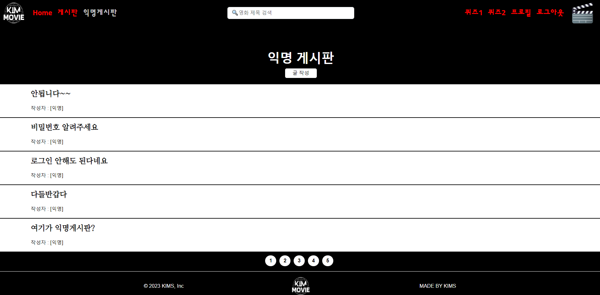

- 비회원도 이용가능한 게시판입니다.
- 인증방식은 간단하게 비밀번호 밖에 없습니다.

### 🌱#3-10 익명게시판 글 작성

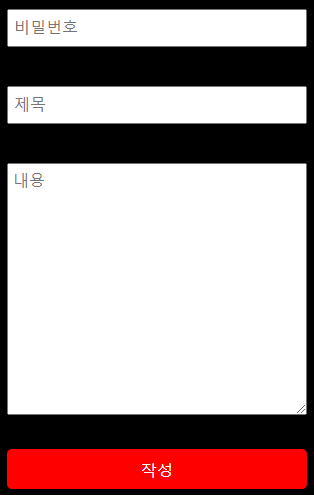

- 비밀번호와 제목, 내용을 입력하고 작성합니다.

### 🌱#3-11 익명게시판 게시글 상세 및 댓글 작성

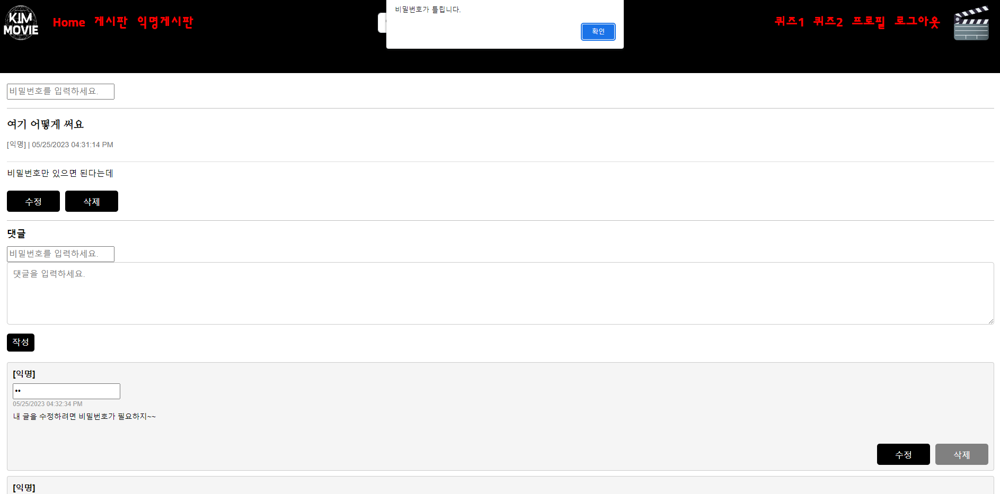

- 비밀번호를 사용해 게시글을 수정 및 삭제할 수 있습니다.

- 비밀번호를 사용해 댓글 작성 및 수정 및 삭제를 할 수 있도록 구현했습니다.

### 🌱#3-12 3문항 퀴즈

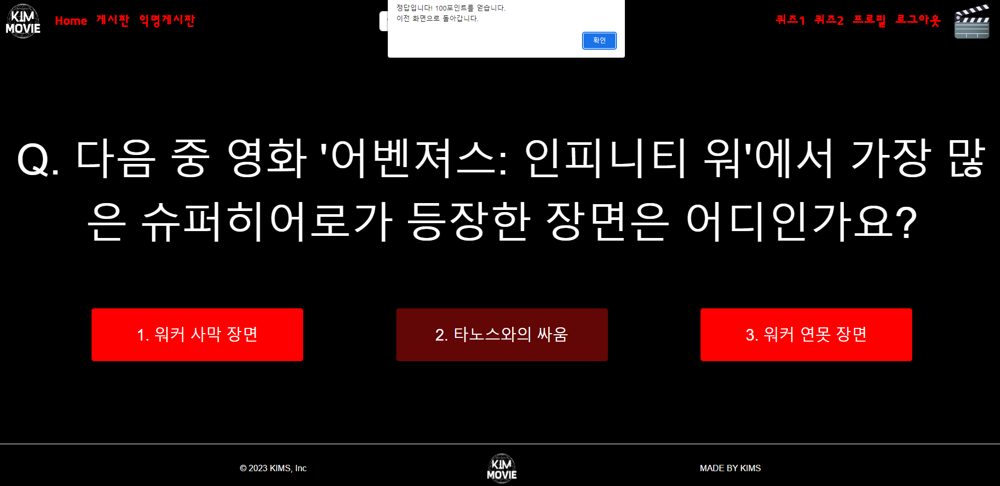

- 문제를 맞추면 포인트와 경험치를 얻고, 문제를 틀리면 포인트를 잃습니다.

### 🌱#3-13 OX 퀴즈

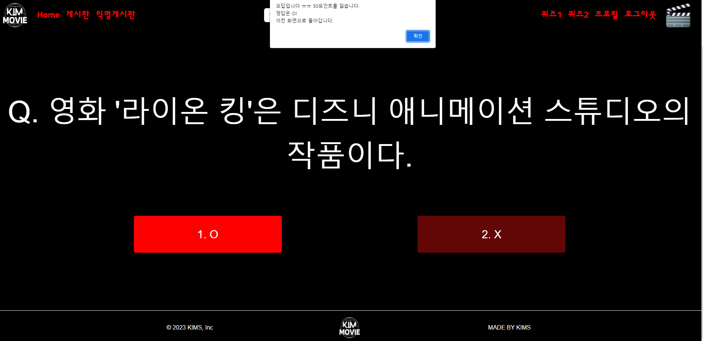

- 문제를 맞추면 포인트와 경험치를 얻고, 문제를 틀리면 포인트를 잃습니다.

# 🌳#4 느낀 점

### 🌱김범기

첫 프로젝트를 제작하면서, 어디에 쓰일지 궁금했던 것들이 여기서 쓰이는 거구나 하고 깨달았습니다. 프로젝트를 위해서, 지금까지 공부해왔던 자료들을 뒤져보고, 없으면 검색을 통해 해결해나가면서 실력이 늘어남을 체감할 수 있었습니다. 실력이 늘어남을 체감하면서도, 우리가 손쉽게 사용하는 사이트 들이 얼마나 많은 개발자들이 고생하며서 만든 것인가 하는 것에 대한 경외감도 들었습니다. 그런 사이트들을 보면서 이번에 만든 첫 사이트도 더 잘 할 수 있지 않을까 하는 아쉬움도 같이 생기지만 현재 할 수 있는 능력에서 끝까지 끌어올려 사용한 것이기에 후회는 없습니다.

팀원과 협업에 있어서는 큰 충돌은 아니지만, 서로 의견의 차이와 속도의 차이 등에 의해 약간의 충돌이 있었으나, 상대의 배려로 원할하게 프로젝트를 진행할 수 있었습니다.

다음에도 프로젝트를 만들겠지만, 이번의 경험을 통해 더 나은 구현으로 팀원과의 더 좋은 협동으로 더 좋은 프로젝트를 생성할 수 있게하겠습니다.

### 🌱김형진

쉼 없이 달리며 첫 프로젝트의 끝에 도달했습니다. 처음으로 완성해본 협업 프로젝트이자 완전한 기능을하는 하나의 서비스를 만들었다는 기분이 들어 매우 벅찼습니다. 지금은, 더욱 완벽하게 만들고 싶은 아쉬움이 남고, 제한된 시간 내에 매 시간 매 분 매 초를 소통하며, 기능 단위로 구현해 서로 어려움도 있었고, 시행착오도 많았습니다.

하지만, 짧은 시간 내에 많은 깨달음과 성장이 있었던만큼 보람있었습니다. 이번 프로젝트에서 가장 좋았던 부분은 페어와 오랜 시간을 소통하며 문제를 함께 해결하며 나아가서 이 정도 결과물이 나올 수 있었던 것 같습니다. 이번 경험을 계기로 한 단계 더 나아가서, 팀원들과 원활히 소통해 2학기도 무사히 마치고싶었습니다. 모두 1학기와 최종 프로젝트 고생 많았습니다!